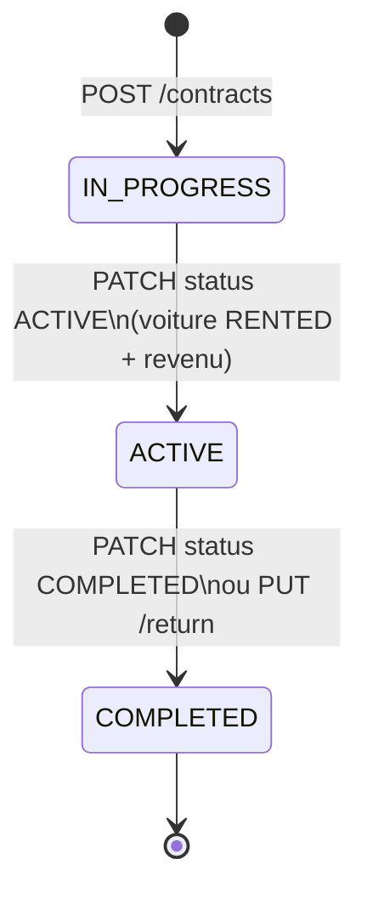

# BOUSSELHA CARS — Fonctionnalités détaillées (Backend & Frontend)

Document de référence décrivant **toutes les capacités** du système de gestion de location de voitures, module par module, avec les règles métier, les API REST et l’équivalent dans l’application Flutter desktop.

---

## Table des matières

1. [Architecture globale](#1-architecture-globale)
2. [Backend — Vue d’ensemble](#2-backend--vue-densemble)
3. [Backend — Voitures (`/api/cars`)](#3-backend--voitures-apicars)
4. [Backend — Clients (`/api/clients`)](#4-backend--clients-apiclients)
5. [Backend — Contrats (`/api/contracts`)](#5-backend--contrats-apicontracts)
6. [Backend — Maintenance (`/api/maintenance`)](#6-backend--maintenance-apimaintenance)
7. [Backend — Tableau de bord (`/api/dashboard`)](#7-backend--tableau-de-bord-apidashboard)
8. [Backend — Génération PDF](#8-backend--génération-pdf)
9. [Backend — Erreurs & sécurité](#9-backend--erreurs--sécurité)
10. [Frontend — Vue d’ensemble](#10-frontend--vue-densemble)
11. [Frontend — Navigation & shell](#11-frontend--navigation--shell)
12. [Frontend — Dashboard](#12-frontend--dashboard)
13. [Frontend — Voitures](#13-frontend--voitures)
14. [Frontend — Clients](#14-frontend--clients)
15. [Frontend — Contrats](#15-frontend--contrats)
16. [Frontend — Maintenance](#16-frontend--maintenance)
17. [Matrice Backend ↔ Frontend](#17-matrice-backend--frontend)
18. [Limites connues](#18-limites-connues)
19. [Fonctionnalités dépendantes du contrat — analyse détaillée](#19-fonctionnalités-dépendantes-du-contrat--analyse-détaillée)

---

## 1. Architecture globale

| Composant | Technologie | Rôle |
|-----------|-------------|------|
| **bousselha-backend** | Spring Boot 3.3, Java 17, JPA/Hibernate, MySQL | API REST, persistance, PDF, fichiers images |
| **bousselha-flutter** | Flutter (desktop Windows), Riverpod, Dio | Interface utilisateur, consommation API |
| **Base de données** | MySQL (`bousselha_db`) | Entités : `cars`, `clients`, `contracts`, `maintenance`, `income_records`, `expense_records` |

- **URL API** : `http://localhost:8080/api` (configurable via `application.properties`)
- **Swagger UI** : `http://localhost:8080/swagger-ui.html`
- **CORS** : toutes origines autorisées sur `/api/**` (méthodes GET, POST, PUT, DELETE, OPTIONS)
- **Pas d’authentification** : l’API est ouverte (usage interne / démo)

---

## 2. Backend — Vue d’ensemble

### Structure des packages

```
com.bousselha
├── domain/          # Entités JPA, enums, repositories
├── application/     # Services métier, DTO request/response
├── infrastructure/  # Controllers REST, exceptions
└── config/          # CORS, OpenAPI/Swagger
```

### Énumérations métier

| Enum | Valeurs | Usage |
|------|---------|--------|
| `CarStatus` | `AVAILABLE`, `RENTED`, `MAINTENANCE` | Statut de la voiture |
| `FuelType` | `ESSENCE`, `DIESEL` | Type de carburant |
| `ContractStatus` | `IN_PROGRESS`, `ACTIVE`, `COMPLETED`, `CANCELLED` | Cycle de vie du contrat |
| `MaintenanceStatus` | `IN_PROGRESS`, `COMPLETED` | Statut d’une maintenance |
| `IncomeSource` | `CONTRACT`, `PAYMENT`, `OTHER` | Source d’un revenu enregistré |

### Persistance

- `spring.jpa.hibernate.ddl-auto=none` : schéma géré manuellement (`bousselha-backend/src/main/resources/db/schema_once.sql`)
- Contrats : **suppression logique** (`deleted = true`) ; les lignes restent en base jusqu’à purge client orphelin
- Voitures : **suppression physique** ; clients : **suppression physique** (souvent déclenchée via le contrat)

---

## 3. Backend — Voitures (`/api/cars`)

### Entité `Car`

| Champ | Type | Description |
|-------|------|-------------|
| `id` | Long | Identifiant auto |
| `brand` | String | Marque (obligatoire) |
| `fuelType` | FuelType | ESSENCE / DIESEL |
| `matricule` | String | Immatriculation (unique) |
| `nextInspectionDate` | LocalDate | Prochaine visite technique |
| `lastOilChangeDate` | LocalDate | Dernière vidange |
| `insuranceExpiryDate` | LocalDate | Expiration assurance |
| `imageUrl` | String | Chemin public ex. `/uploads/cars/{uuid}.jpg` |
| `status` | CarStatus | Par défaut `AVAILABLE` |
| `createdAt`, `updatedAt` | LocalDateTime | Horodatage |

### Endpoints

| Méthode | Route | Description |
|---------|-------|-------------|
| `GET` | `/api/cars` | Liste de toutes les voitures |
| `GET` | `/api/cars/{id}` | Détail d’une voiture |
| `GET` | `/api/cars/available` | Voitures `AVAILABLE` |
| `GET` | `/api/cars/rented` | Voitures `RENTED` |
| `GET` | `/api/cars/maintenance` | Voitures `MAINTENANCE` |
| `POST` | `/api/cars` | Création (**multipart/form-data**) |
| `PUT` | `/api/cars/{id}` | Mise à jour (**multipart/form-data**) |
| `DELETE` | `/api/cars/{id}` | Suppression |
| `GET` | `/api/cars/{id}/history` | Historique locations + maintenances |

### Création / mise à jour (paramètres formulaire)

- `brand`, `fuelType`, `matricule` : obligatoires
- `nextInspectionDate`, `lastOilChangeDate`, `insuranceExpiryDate` : optionnels (`YYYY-MM-DD`)
- `status` : optionnel (défaut `AVAILABLE` à la création)
- `image` : fichier optionnel (`.jpg`, `.jpeg`, `.png` uniquement)

### Règles métier

1. **Image** : stockée dans `src/main/resources/static/uploads/cars/`, URL publique `/uploads/cars/{uuid}.ext`
2. **Suppression** : refusée si un contrat **IN_PROGRESS** ou **ACTIVE** existe → `Impossible : voiture avec contrat en cours`
3. **Disponibilité calendrier** (`GET /api/cars/availability?date=`) : une voiture est **Louée** si un contrat (non supprimé) couvre la date (statuts `IN_PROGRESS`, `ACTIVE`, ou `COMPLETED` dans la plage)
4. **Historique** : alimenté par les contrats liés à la voiture
3. **Historique** (`/history`) : fusionne
   - les contrats non supprimés liés à la voiture (type `RENTAL`, client, dates, montant, statut contrat)
   - les enregistrements maintenance (type `MAINTENANCE`, type, dates, coût)
   - tri par date de début **décroissante**

### Réponse `CarResponse`

`id`, `brand`, `fuelType`, `matricule`, dates d’entretien/assurance, `imageUrl`, `status`

---

## 4. Backend — Clients (`/api/clients`)

### Entité `Client`

**Section locataire**

| Champ | Description |
|-------|-------------|
| `fullName` | Nom & prénom |
| `birthDate` | Date de naissance |
| `addressMorocco`, `addressAbroad` | Adresses |
| `profession` | Profession |
| `drivingLicenseNumber`, `drivingLicenseIssuedAt` | Permis (n° et ville de délivrance) |
| `cinNumber` | CIN |
| `passportNumber`, `passportIssuedAt` | Passeport |
| `phone` | Téléphone |

**Section conducteur supplémentaire** (stockée sur le client)

| Champ | Description |
|-------|-------------|
| `additionalDriverFullName` | Nom |
| `additionalDriverDrivingLicenseNumber` | Permis |
| `additionalDriverDrivingLicenseIssuedAt` | Date délivrance permis |
| `additionalDriverPassportNumber` | Passeport |

### Endpoints

| Méthode | Route | Description |
|---------|-------|-------------|
| `GET` | `/api/clients` | Liste |
| `GET` | `/api/clients/{id}` | Détail |
| `POST` | `/api/clients` | Création (JSON, `@Valid`) |
| `PUT` | `/api/clients/{id}` | Mise à jour (JSON) |
| `DELETE` | `/api/clients/{id}` | Suppression |

### Validation `ClientRequest`

- Obligatoires : `fullName`, `phone`
- `cinNumber` : **optionnel**
- Autres champs optionnels

### Règles métier

- **Création** : dans l’UI, les clients sont créés **via le wizard « Nouveau contrat »** (étape 1), pas depuis la liste clients
- **Suppression manuelle** : refusée si contrat **IN_PROGRESS** ou **ACTIVE**
- **Suppression automatique** : si le dernier contrat du client est supprimé (soft-delete) et qu’il ne reste aucun contrat actif, le client et ses contrats archivés sont purgés (`OrphanClientService`)

---

## 5. Backend — Contrats (`/api/contracts`)

### Entité `Contract`

Lie une **voiture** et un **client**, avec tarification, paiements et état du véhicule.

| Groupe | Champs principaux |
|--------|-------------------|
| Relations | `car`, `client` |
| Conducteur supp. (sur contrat) | `additionalDriverName`, `additionalDriverLicense`, `additionalDriverPassport` |
| Lieux / dates | `departurePlace`, `returnPlace`, `departureDatetime`, `expectedReturnDatetime`, `actualReturnDatetime`, `durationDays` |
| Tarifs | `pricePerHour/Day/Week/Month`, `withInsurance`, `totalPrice`, `supplement`, `totalGeneral` |
| Paiement | `paymentCash`, `paymentCheck`, `paymentDeposit` |
| Dommages (PDF / données) | `vehicleConditionDeparture`, `vehicleConditionReturn`, `damagesIdentified` |
| Statut | `status` (défaut **`IN_PROGRESS`**), `deleted`, `createdAt` |

### Endpoints

| Méthode | Route | Description |
|---------|-------|-------------|
| `GET` | `/api/contracts` | Tous les contrats non supprimés |
| `GET` | `/api/contracts?carId={id}` | Contrats d’une voiture |
| `GET` | `/api/contracts/{id}` | Détail (réponse enrichie client + voiture) |
| `GET` | `/api/contracts/active` | Contrats **`IN_PROGRESS`** + **`ACTIVE`** |
| `POST` | `/api/contracts` | Création |
| `PUT` | `/api/contracts/{id}` | Mise à jour |
| `PATCH` | `/api/contracts/{id}/status` | Transition **`IN_PROGRESS` → `ACTIVE`** ou **`ACTIVE` → `COMPLETED`** |
| `PUT` | `/api/contracts/{id}/return` | Alias clôture → `COMPLETED` |
| `DELETE` | `/api/contracts/{id}` | **Suppression logique** (204) + purge client orphelin |
| `GET` | `/api/contracts/{id}/pdf` | PDF binaire |

### Règles métier — Création

1. La voiture doit être **`AVAILABLE`** (pas en maintenance ni déjà louée)
2. Aucun autre contrat **ouvert** (`IN_PROGRESS` ou `ACTIVE`) sur cette voiture
3. Le client doit exister (créé juste avant via l’UI ou déjà en base)
4. Statut initial : **`IN_PROGRESS`** — la voiture **reste `AVAILABLE`** (réservation / préparation)

### Règles métier — Activation (`PATCH .../status` → `ACTIVE`)

1. Uniquement depuis **`IN_PROGRESS`**
2. La voiture doit encore être **`AVAILABLE`**
3. Contrat → **`ACTIVE`**, voiture → **`RENTED`**
4. Enregistrement d’un **revenu** (`income_records`, source `CONTRACT`, montant = `totalGeneral`)

### Règles métier — Fin de location (`ACTIVE` → `COMPLETED` ou `/return`)

1. Uniquement depuis **`ACTIVE`**
2. `actualReturnDatetime` = maintenant
3. Contrat → **`COMPLETED`**, voiture → **`AVAILABLE`**

### Règles métier — Mise à jour

1. Si **ACTIVE** : impossible de changer de voiture
2. Si **IN_PROGRESS** : changement de voiture autorisé seulement vers une voiture **`AVAILABLE`**
3. Si **ACTIVE** après MAJ : voiture maintenue en **`RENTED`**

### Règles métier — Suppression

1. **Interdit** si **`IN_PROGRESS`** ou **`ACTIVE`**
2. Sinon : `deleted = true` ; si le client n’a plus de contrat actif → **suppression automatique du client** (et purge physique des contrats supprimés + revenus liés)

### Réponse `ContractResponse`

Réponse très complète pour l’écran détail Flutter : infos voiture, client (y compris adresses, permis, CIN, téléphone), conducteur supplémentaire, dates, grille tarifaire, paiements, dommages, `createdAt`, `status`.

---

## 6. Backend — Maintenance (`/api/maintenance`)

### Entité `Maintenance`

| Champ | Description |
|-------|-------------|
| `car` | Voiture concernée |
| `type` | Type d’intervention |
| `description` | Texte libre |
| `startDate`, `endDate` | Période |
| `cost` | Coût |

### Endpoints

| Méthode | Route | Description |
|---------|-------|-------------|
| `GET` | `/api/maintenance` | Toutes les maintenances |
| `GET` | `/api/maintenance/car/{carId}` | Par voiture |
| `POST` | `/api/maintenance` | Création |
| `PUT` | `/api/maintenance/{id}` | Mise à jour |

> **Note** : pas d’endpoint `DELETE` côté API.

### Impact sur le statut voiture

| Situation | Statut voiture |
|-----------|----------------|
| `endDate` est **null** (maintenance en cours) | `MAINTENANCE` |
| `endDate` renseignée et voiture était `MAINTENANCE` | repasse à `AVAILABLE` |

---

## 7. Backend — Tableau de bord (`/api/dashboard`)

### `GET /api/dashboard/stats`

Retourne `DashboardResponse` :

| Champ | Signification |
|-------|---------------|
| `totalCars` | Nombre total de voitures |
| `available` | Compte `AVAILABLE` |
| `rented` | Compte `RENTED` |
| `maintenance` | Compte `MAINTENANCE` |

### `GET /api/dashboard/calendar`

Liste des contrats **en cours** (`IN_PROGRESS` + `ACTIVE`) — même logique que `/api/contracts/active`.

### Revenus / dépenses (liés indirectement aux contrats)

- **Revenus** : enregistrés à l’**activation** du contrat (`ACTIVE`) dans `income_records`
- **Dépenses** : liées aux maintenances, pas aux contrats
- Détail : `GET /api/financial/income` et `GET /api/financial/expenses` (cartes cliquables du dashboard Flutter)

### `GET /api/dashboard/alerts`

Alertes calculées sur **toutes les voitures** :

| Type | Condition | Sévérité |
|------|-----------|----------|
| `INSURANCE` | Assurance expire dans ≤ **30 jours** ou déjà expirée | `MEDIUM` si ≤ 30 j, `HIGH` si date passée |
| `INSPECTION` | Contrôle technique dans ≤ **30 jours** ou dépassé | idem |
| `OIL_CHANGE` | Dernière vidange > **180 jours** | `MEDIUM` |

Chaque alerte : `type`, `carId`, `carLabel`, `message`, `severity`, `dueDate`.

### Comment tester les alertes (manuellement)

**Prérequis** : backend démarré (`mvn spring-boot:run`), application Flutter ouverte sur l’onglet **Dashboard**.

| Étape | Action | Résultat attendu |
|-------|--------|------------------|
| 1 | Ouvrir **Voitures** → **Modifier** une voiture (ou en créer une) | Formulaire avec dates visite / vidange / assurance |
| 2 | Renseigner **Expiration assurance** à une date dans **≤ 30 jours** (ex. aujourd’hui + 15 jours, format `YYYY-MM-DD`) | — |
| 3 | **Enregistrer**, puis aller sur **Dashboard** | Panneau droit : alerte **INSURANCE**, icône orange, message assurance, date d’échéance |
| 4 | Mettre **Prochaine visite** à une date passée ou dans 30 jours | Alerte **INSPECTION** (rouge si date passée = `HIGH`, orange si à venir = `MEDIUM`) |
| 5 | Mettre **Dernière vidange** à une date **> 180 jours** dans le passé (ex. aujourd’hui − 200 jours) | Alerte **OIL_CHANGE** (vidange en retard) |
| 6 | Mettre toutes ces dates **loin dans le futur** (ex. + 1 an) ou les laisser vides | Panneau droit : **« Aucune alerte. »** |

**Vérification API (optionnelle)** : dans Swagger (`http://localhost:8080/swagger-ui.html`), appeler `GET /api/dashboard/alerts` et contrôler le JSON (tableau vide ou objets avec `type`, `carLabel`, `severity`, `dueDate`).

**Rafraîchir les données** : bouton rafraîchir du module ou redémarrer l’onglet Dashboard ; les alertes sont recalculées à chaque appel API (pas de cache côté serveur).

> Les alertes ne dépendent **pas** des contrats ni des maintenances : uniquement des **dates enregistrées sur la fiche voiture**.

---

## 8. Backend — Génération PDF

### Flux

```
GET /api/contracts/{id}/pdf
  → PdfService.generateContractPdf(id)
  → ContractRepository.findDetailedById (JOIN FETCH car + client)
  → Apache PDFBox 3.0.3 : 1 page A4
  → byte[] renvoyé (Content-Type: application/pdf, inline)
```

### Contenu actuel du PDF (version simplifiée)

Le PDF généré est un **résumé** (pas le formulaire complet affiché dans Flutter) :

- Titre : « BOUSSELHA CARS - CONTRAT DE LOCATION »
- Client, véhicule (marque + immatricule)
- Date de départ, retour prévu
- Total général

Les sections détaillées (dommages, observation légale, signature) ne sont **pas** encore dans le PDF programmatique ; elles peuvent exister en base mais l’UI détail Flutter les masque volontairement (réservées au futur PDF complet).

---

## 9. Backend — Erreurs & sécurité

### `GlobalExceptionHandler`

| Exception | HTTP | Corps |
|-----------|------|-------|
| `ResourceNotFoundException` | 404 | `{ "error": "..." }` |
| `MethodArgumentNotValidException` | 400 | `{ "error": "Validation failed", "fields": {...} }` |
| `IllegalArgumentException` | 400 | `{ "error": "..." }` |
| Autres | 500 | `{ "error": "..." }` |

### Flutter — interception Dio

`DioClient` relaie le champ `error` de la réponse JSON dans le message d’exception Dio.

---

## 10. Frontend — Vue d’ensemble

### Stack

| Élément | Détail |
|---------|--------|
| État global | **Riverpod** (`FutureProvider`, `Provider`) |
| HTTP | **Dio** — base `http://localhost:8080/api` |
| UI | **Material 3**, application **desktop** (Windows cible principale) |
| Packages notables | `intl` (dates), `url_launcher` (PDF navigateur), `file_picker` (images voitures) |

### Fichiers clés

| Fichier | Rôle |
|---------|------|
| `lib/main.dart` | Point d’entrée, thème, `HomeShell` |
| `lib/presentation/home_shell.dart` | Navigation latérale + pages |
| `lib/shared/providers/app_providers.dart` | Providers repositories & données |
| `lib/data/repositories/*.dart` | Appels API par domaine |
| `lib/core/network/dio_client.dart` | Configuration Dio |

---

## 11. Frontend — Navigation & shell

### `HomeShell`

- **NavigationRail** (6 onglets) : Dashboard, Voitures, Clients, Contrats, Maintenance, Calendrier
- **AppBar globale** : titre `BOUSSELHA CARS - {module}` pour tous les onglets **sauf Contrats** (l’écran Contrats a sa propre AppBar intégrée)
- Contenu : `IndexedStack` (état conservé entre onglets)

---

## 12. Frontend — Dashboard

**Fichier** : `lib/presentation/dashboard/dashboard_screen.dart`

### Fonctionnalités

1. **Cartes statistiques** (6 indicateurs)
   - Total voitures, Disponibles, Louées, En maintenance, **Revenus (Income)**, **Dépenses (Expense)** — cartes revenus/dépenses **cliquables** vers écrans détail filtrés
   - Source : `GET /api/dashboard/stats` + `GET /api/financial/income|expenses`

2. **Calendrier des locations actives** (panneau gauche)
   - Liste : voiture, client, dates départ → retour prévu
   - Source : `GET /api/dashboard/calendar`

3. **Alertes véhicules** (panneau droit, sous le calendrier des locations actives)
   - Rappels **assurance**, **contrôle technique**, **vidange** (voir §7 — `GET /api/dashboard/alerts`)
   - Icône rouge si `severity = HIGH` (échéance dépassée), orange sinon (`MEDIUM`)
   - Affichage : `carLabel`, type (`INSURANCE` / `INSPECTION` / `OIL_CHANGE`), message, `dueDate`
   - Si aucune condition n’est remplie : **« Aucune alerte. »**

4. **États UI** : chargement (`CircularProgressIndicator`), erreur réseau affichée

#### Comment tester les alertes depuis l’interface

Voir le guide pas à pas : **[§7 — Comment tester les alertes](#comment-tester-les-alertes-manuellement)**.

Résumé rapide :

1. **Voitures** → modifier une voiture.
2. Saisir au moins une date « sensible » (assurance ou visite dans les 30 prochains jours, ou vidange il y a plus de 6 mois).
3. **Dashboard** → vérifier le panneau de droite (liste d’alertes ou « Aucune alerte. »).
4. Corriger les dates → l’alerte correspondante disparaît au prochain chargement.

---

## 13. Frontend — Voitures

**Fichier** : `lib/presentation/cars/car_list_screen.dart`

### Liste des voitures

| Action | Détail |
|--------|--------|
| Affichage | Carte par voiture : vignette (Hero), marque, immatricule, carburant, prochaine visite, **chip statut** coloré |
| Ajouter | Dialogue formulaire (`showCarFormDialog`) → `POST /api/cars` (multipart + image optionnelle) |
| Modifier | Menu contextuel ou depuis le détail → `PUT /api/cars/{id}` |
| Supprimer | Confirmation → `DELETE /api/cars/{id}` |
| Rafraîchir | `ref.invalidate(carsProvider)` |
| Ouvrir détail | Navigation animée (`carDetailRoute` : fade + slide + **Hero** image) |

### Formulaire voiture

Champs : marque, matricule, carburant (Essence/Diesel), statut (Disponible / Louée / Maintenance), dates visite/vidange/assurance (`YYYY-MM-DD`), **photo** (sélection fichier locale).

Images affichées via URL publique : `http://localhost:8080` + `imageUrl` retourné par l’API.

### Écran détail voiture (`CarDetailScreen`)

| Zone | Contenu |
|------|---------|
| En-tête | `SliverAppBar` expansé, photo pleine largeur (Hero), titre, badge statut |
| Infos | Cartes premium : marque, immatricule, carburant, dates entretien, statut |
| Alertes | Chips si visite technique ou assurance dans les **30 prochains jours** |
| Timeline contrats | Contrats de la voiture (`GET /api/contracts?carId=`) triés par date départ, cartes timeline |
| Actions flottantes | **Modifier**, **Supprimer** (FAB) |

---

## 14. Frontend — Clients

**Fichier** : `lib/presentation/clients/client_list_screen.dart`

### Liste

| Action | Détail |
|--------|--------|
| Affichage | `#id`, nom, téléphone |
| Ajout manuel | **Désactivé** — clients créés via **Nouveau contrat** (§19) |
| Détail | `ClientDetailScreen` — **Modifier** uniquement |
| Rafraîchir | Invalidation `clientsProvider` |

### Formulaire client (création / édition)

**Section 1 — Locataire** : nom, date naissance, adresses Maroc/étranger, profession, permis, CIN, passeport (+ date), téléphone.

**Section 2 — Conducteur supplémentaire** : nom, permis, date délivrance, passeport.

Champs obligatoires côté UI (wizard contrat) : nom, téléphone ; CIN optionnel.

### Écran détail client

- Affichage structuré de toutes les informations
- Bouton **Modifier** uniquement (suppression automatique via contrat — §19)

---

## 15. Frontend — Contrats

**Fichier** : `lib/presentation/contracts/contract_list_screen.dart`

### Liste (design entreprise)

- AppBar marine : **BOUSSELHA CARS — Contrats**
- Bouton doré **Nouveau contrat**, rafraîchir
- Cartes : icône document, titre `Marque - Immat — Client`, sous-titre dates `jj/mm/aaaa`, badge statut, montant en **or**, chevron

### Création / modification (wizard `_showUnifiedContractSheet`)

| Élément | Détail |
|---------|--------|
| Étape 1 | Client (formulaire) → **Suivant** |
| Étape 2 | Voiture **disponibles**, dates, tarifs, paiement → **Précédent** / **Enregistrer** |
| Création | `POST /clients` + `POST /contracts` → **`IN_PROGRESS`** |
| Édition | Voiture verrouillée si contrat **ACTIVE** ; `PUT /api/contracts/{id}` |
| Activation / fin | `PATCH /api/contracts/{id}/status` (voir §19) |

### Écran détail contrat (`ContractDetailScreen`)

**Sections affichées** (design cartes marine/doré) :

1. Véhicule  
2. Dates  
3. Locataire (المكتري)  
4. Conducteur supplémentaire  
5. Grille tarifaire  
6. Paiement (الأداء)  

**Non affiché** (réservé PDF futur) : section dommages, observation légale, signature, « Fait à Tanger ».

**PDF**

| Bouton | Comportement |
|--------|--------------|
| Enregistrer PDF | Ouvre l’URL dans le navigateur (`launchUrl`) |
| Télécharger PDF | `GET` bytes → fichier dans dossier **Downloads** |

**Barre d’actions fixe en bas**

| Bouton | Comportement |
|--------|--------------|
| Activer (livraison) | `IN_PROGRESS` → `PATCH` `ACTIVE` |
| Terminer | `ACTIVE` → `COMPLETED` |
| Modifier | Formulaire unifié |
| Supprimer | Interdit si ouvert ; sinon soft-delete (+ client orphelin) |

### Badges statut (UI)

| Statut | Style |
|--------|-------|
| `IN_PROGRESS` | Ambre |
| `ACTIVE` | Vert |
| `COMPLETED` | Bleu |
| `CANCELLED` | Rouge |

---

## 16. Frontend — Maintenance

**Fichier** : `lib/presentation/maintenance/maintenance_list_screen.dart`

| Action | Détail |
|--------|--------|
| Liste | Type, voiture, dates début/fin, coût MAD |
| Ajouter / Modifier | Dates, type, coût, description, statut → `POST` / `PUT /api/maintenance` |
| Rafraîchir | Invalidation `maintenanceProvider` et voitures |

---

## 17. Matrice Backend ↔ Frontend

| Fonctionnalité API | Utilisé Flutter | Écran / remarque |
|--------------------|-----------------|------------------|
| `GET /cars` | Oui | Liste voitures |
| `GET /cars/available` | Oui | Création contrat, édition contrat |
| `GET /cars/rented` | Non | — |
| `GET /cars/maintenance` | Non | — |
| `GET /cars/{id}` | Non | Détail utilise données liste |
| `GET /cars/{id}/history` | Non | Timeline utilise `GET /contracts?carId=` |
| `POST/PUT/DELETE /cars` | Oui | Formulaire voiture |
| `GET/POST/PUT/DELETE /clients` | Oui | Liste + détail client |
| `GET /clients/{id}` | Oui | Détail client |
| `GET /contracts` | Oui | Liste contrats |
| `GET /contracts?carId=` | Oui | Détail voiture (timeline) |
| `GET /contracts/{id}` | Oui | Détail contrat |
| `GET /contracts/active` | Non direct | Dashboard utilise `/dashboard/calendar` |
| `POST /contracts` | Oui | Nouveau contrat |
| `PUT /contracts/{id}` | Oui | Modifier contrat |
| `PUT /contracts/{id}/return` | Oui | Terminer contrat |
| `DELETE /contracts/{id}` | Oui | Supprimer (soft) |
| `GET /contracts/{id}/pdf` | Oui | PDF |
| `GET/POST /maintenance` | Oui | Liste + ajout |
| `PUT /maintenance/{id}` | Non | — |
| `GET /maintenance/car/{id}` | Non | — |
| `GET /dashboard/stats` | Oui | Dashboard |
| `GET /dashboard/calendar` | Oui | Dashboard |
| `GET /dashboard/alerts` | Oui | Dashboard |

---

## 18. Limites connues

1. **Pas d’authentification** ni gestion des rôles.
2. **PDF simplifié** : ne reflète pas toutes les sections du contrat affichées dans l’app.
3. **Historique voiture API** (`/cars/{id}/history`) non consommé par Flutter.
4. **Maintenance** : pas d’édition ni suppression dans l’UI.
5. **Filtres liste** : pas de recherche texte / tri avancé sur les listes.
6. **Images voitures** : URL en `localhost:8080` — à adapter si déploiement distant.
7. **Contrat CANCELLED** : peu ou pas de flux UI dédié pour annuler un contrat (enum existe côté backend).

---

## Démarrage rapide

Voir le fichier racine [`README.md`](README.md) pour les commandes `mvn spring-boot:run` et `flutter run -d windows`.

---

---

## 19. Fonctionnalités dépendantes du contrat — analyse détaillée

Le **contrat de location** est l’entité centrale du métier : il relie une **voiture**, un **client**, des **montants**, des **dates** et un **statut**. De nombreuses autres fonctionnalités du système ne fonctionnent qu’en présence, en absence ou selon l’état d’un contrat.

### 19.1 Rôle du contrat dans le modèle de données

```
┌─────────────┐       ┌─────────────┐       ┌─────────────┐
│   Client    │◄──────│  Contract   │──────►│     Car     │
└─────────────┘  1:N  └──────┬──────┘  N:1  └─────────────┘
                             │
                             │ 1:0..1
                             ▼
                      ┌─────────────┐
                      │ income_record│  (revenu, source CONTRACT)
                      └─────────────┘
```

| Relation | Cardinalité | Conséquence |
|----------|-------------|-------------|
| Client ↔ Contrat | 1 client, N contrats | Un client existe parce qu’au moins un contrat l’a référencé (création UI) |
| Voiture ↔ Contrat | 1 voiture, N contrats (dans le temps) | Une seule location **ouverte** à la fois par voiture |
| Contrat ↔ Revenu | 0..1 enregistrement `income_records` | Créé à l’activation (`ACTIVE`) |

---

### 19.2 Cycle de vie du contrat (statuts)

| Statut | Signification métier | Effet sur la voiture | Visible où (Flutter) |
|--------|---------------------|----------------------|----------------------|
| **`IN_PROGRESS`** | Contrat préparé / réservé, pas encore livré | Voiture reste **`AVAILABLE`** | Liste contrats, détail, calendrier dashboard, calendrier dispo. |
| **`ACTIVE`** | Location en cours (véhicule chez le client) | Voiture **`RENTED`** | Idem + compteur « Louées » du dashboard |
| **`COMPLETED`** | Location terminée | Voiture **`AVAILABLE`** (si pas maintenance) | Historique, calendrier passé, suppression possible |
| **`CANCELLED`** | Annulé (enum prévu) | Peu utilisé dans l’UI actuelle | Badge rouge si présent |

#### Transitions autorisées (backend)



| Action UI (Flutter) | Appel API | Transition |
|---------------------|-----------|------------|
| **Nouveau contrat** (étape 2, Enregistrer) | `POST /api/contracts` | → `IN_PROGRESS` |
| **Activer (livraison)** | `PATCH /api/contracts/{id}/status` `{ "status": "ACTIVE" }` | `IN_PROGRESS` → `ACTIVE` |
| **Terminer** | `PATCH` → `COMPLETED` ou `PUT .../return` | `ACTIVE` → `COMPLETED` |
| **Supprimer** | `DELETE /api/contracts/{id}` | Soft-delete (si pas ouvert) |

---

### 19.3 Fonctionnalités **directement** pilotées par le contrat

#### A. Module Contrats (cœur métier)

| Fonctionnalité | Dépendance contrat | Détail |
|----------------|-------------------|--------|
| Liste des contrats | Tous les `deleted = false` | Cartes avec client, voiture, dates, montant, badge statut |
| Détail contrat | `GET /contracts/{id}` | 6 sections UI : véhicule, dates, locataire, conducteur supp., tarifs, paiement |
| Création en 2 étapes | Nouveau contrat | **Étape 1** : fiche client (sans API) → **Étape 2** : voiture + tarifs → `POST` client puis `POST` contrat |
| Navigation Précédent / Suivant | Wizard création | Retour étape 1 pour corriger le client avant validation |
| Modification | `PUT /contracts/{id}` | Verrouillage voiture si `ACTIVE` |
| PDF contrat | `GET /contracts/{id}/pdf` | Contenu basé sur le contrat + client + voiture (résumé PDFBox) |

#### B. Statut et disponibilité des **voitures**

| Règle | Déclencheur contrat |
|-------|---------------------|
| Voiture **non sélectionnable** à la création | `GET /cars/available` : exclut tout sauf `AVAILABLE` |
| Voiture passe **Louée** | Contrat → `ACTIVE` |
| Voiture redevient **Disponible** | Contrat → `COMPLETED` (si pas maintenance en cours) |
| Impossible de **supprimer** la voiture | Contrat ouvert (`IN_PROGRESS` ou `ACTIVE`) sur cette voiture |
| **Timeline** sur fiche voiture | `GET /contracts?carId=` : historique des locations |

#### C. Module **Clients**

| Fonctionnalité | Lien avec le contrat |
|----------------|---------------------|
| **Création client** | Uniquement via **Nouveau contrat** (pas de bouton « Ajouter client » sur la liste) |
| **Suppression client (UI)** | Bouton retiré ; suppression **automatique** si plus aucun contrat actif après suppression du dernier contrat |
| **Modification client** | Indépendante, mais le client reste lié à ses contrats passés |
| Blocage suppression manuelle API | Tant qu’un contrat `IN_PROGRESS` / `ACTIVE` existe |

#### D. **Revenus** (Income / dashboard)

| Étape | Lien contrat |
|-------|--------------|
| Enregistrement revenu | À l’activation : `totalGeneral` → table `income_records`, `source = CONTRACT`, `contract_id` renseigné |
| Carte dashboard « Revenus » | Somme des `income_records` |
| Écran détail revenus | Filtres + liste ; chaque ligne peut référencer `contractId` et la description « Contrat #n — Nom client » |

> Les revenus ne sont **pas** créés à la simple création (`IN_PROGRESS`) : seulement à la **livraison / activation**.

#### E. **Tableau de bord**

| Widget | Donnée issue des contrats |
|--------|---------------------------|
| Compteur **Louées** | Voitures en statut `RENTED` (mis à jour par contrat `ACTIVE`) |
| **Calendrier des locations actives** | `GET /dashboard/calendar` = contrats `IN_PROGRESS` + `ACTIVE` |
| (Indirect) **Disponibles** | Voitures `AVAILABLE` non bloquées par un contrat ouvert |

#### F. Module **Calendrier** (disponibilité par date)

Pour une date donnée (`GET /api/cars/availability?date=`):

| Affichage | Condition liée au contrat |
|-----------|---------------------------|
| **Loué** | Un contrat non supprimé couvre la date (départ ≤ date ≤ retour prévu ou réel) et statut ∈ {`IN_PROGRESS`, `ACTIVE`, `COMPLETED` dans la plage} |
| **Disponible** | Pas de maintenance ce jour-là **et** pas de contrat couvrant la date |

---

### 19.4 Fonctionnalités **indirectement** liées au contrat

| Module | Lien |
|--------|------|
| **Maintenance** | Prioritaire sur le contrat pour le statut voiture : maintenance en cours → `MAINTENANCE` même si aucun contrat |
| **Alertes dashboard** | Basées sur les **voitures** (assurance, visite, vidange), pas sur les contrats |
| **Dépenses (Expense)** | Liées aux **maintenances**, pas aux contrats |
| **Suppression logique contrat** | Peut entraîner la **disparition du client** de la liste (purge orphelin) |

---

### 19.5 Matrice « Qui dépend de quoi ? »

| Fonctionnalité système | Sans contrat | Contrat `IN_PROGRESS` | Contrat `ACTIVE` | Contrat `COMPLETED` |
|------------------------|--------------|------------------------|------------------|---------------------|
| Client en liste | Possible (orphelin rare) | Oui | Oui | Oui (jusqu’à purge) |
| Voiture en location (`RENTED`) | Non | Non | **Oui** | Non |
| Voiture choisissable nouveau contrat | Oui si `AVAILABLE` | Non (déjà réservée si même voiture) | Non | Oui si `AVAILABLE` |
| Revenu enregistré | Non | Non | **Oui** | Oui (déjà enregistré à l’activation) |
| PDF contrat | Non | Oui | Oui | Oui |
| Suppression contrat | — | Non | Non | Oui (soft-delete) |
| Suppression client auto | — | Non | Non | Possible si dernier contrat supprimé |

---

### 19.6 Parcours utilisateur typique (frontend)

1. **Contrats** → **Nouveau contrat**
2. **Étape 1** : saisie locataire (+ conducteur supplémentaire optionnel) → **Suivant**
3. **Étape 2** : choix voiture **disponible**, dates, tarifs, paiement → **Enregistrer**  
   → API : création client + création contrat **`IN_PROGRESS`**
4. Fiche contrat → **Activer (livraison)**  
   → voiture **Louée**, revenu enregistré, contrat **`ACTIVE`**
5. Fin de location → **Terminer**  
   → voiture **Disponible**, contrat **`COMPLETED`**
6. (Optionnel) **Supprimer** le contrat archivé  
   → si dernier contrat du client : **client retiré de la liste**

---

### 19.7 Fichiers source à consulter

| Couche | Fichiers principaux |
|--------|---------------------|
| Backend métier | `ContractService.java`, `OrphanClientService.java`, `FinancialService.java`, `CarService.java` (availability, delete) |
| Backend API | `ContractController.java`, `PdfService.java` |
| Backend modèle | `Contract.java`, `ContractStatus.java`, `IncomeRecord.java` |
| Frontend | `contract_list_screen.dart`, `client_list_screen.dart` (`pickClientForNewContract`), `car_list_screen.dart` (timeline), `dashboard_screen.dart`, `income_detail_screen.dart`, `calendar_screen.dart` |

---

*Document généré à partir de l’analyse du code source du dépôt BOUSSELHA CARS.*
