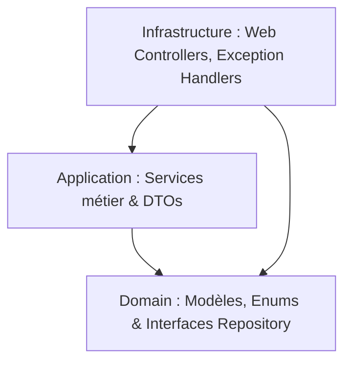

# 🚗 BOUSSELHA CARS — Guide Complet du Développeur Débutant

Bienvenue dans le projet **BOUSSELHA CARS** ! Ce document a été spécialement conçu pour t'aider à comprendre, installer, exécuter et faire évoluer ce projet, même si tu débutes dans le développement d'applications d'entreprise.

Ce projet est un **Monorepo** qui regroupe un système complet de gestion de location de voitures. Il se compose d'un backend robuste en **Spring Boot 3** et d'une application de bureau moderne en **Flutter**.

---

## 📌 Table des Matières
1. [📐 Architecture du Projet](#-architecture-du-projet)
2. [🛠️ Prérequis Système](#%EF%B8%8F-prérequis-système)
3. [💾 Configuration de la Base de Données (MySQL)](#-configuration-de-la-base-de-données-mysql)
4. [⚡ Lancement du Backend (Spring Boot)](#-lancement-du-backend-spring-boot)
5. [📱 Lancement du Frontend (Flutter Desktop)](#-lancement-du-frontend-flutter-desktop)
6. [🔄 Flux Métier & Fonctionnalités](#-flux-métier--fonctionnalités)
7. [🚀 Guide de Déploiement & Compilation (Production)](#-guide-de-déploiement--compilation-production)
8. [💡 Guide de Survie pour Développeur Débutant](#-guide-de-survie-pour-développeur-débutant)

---

## 📐 Architecture du Projet

Le projet est divisé en deux grands répertoires principaux :
*   `bousselha-backend` : L'API et le traitement de données.
*   `bousselha-flutter` : L'interface utilisateur de bureau (Windows).

### 🖥️ 1. Le Backend (Spring Boot 3 + Java 17)

Le backend utilise une architecture **DDD (Domain-Driven Design)** simplifiée. C'est une excellente pratique qui sépare le code en couches distinctes selon leur rôle :



Voici comment naviguer dans le dossier `bousselha-backend/src/main/java/com/bousselha/` :

*   **`domain/` (Le Cœur Métier) :**
    *   `model/` : Contient les classes qui représentent nos tables de base de données (ex: `Car.java`, `Client.java`, `Contract.java`, `Maintenance.java`, `IncomeRecord.java`, `ExpenseRecord.java`).
    *   `enums/` : Les statuts et types fixes (ex: `CarStatus.java`, `ContractStatus.java`, `FuelType.java`).
    *   `repository/` : Les interfaces JPA pour communiquer avec la base de données. Spring Data JPA génère automatiquement le code SQL pour nous !
*   **`application/` (La Logique Applicative) :**
    *   `service/` : C'est ici que se trouve toute l'intelligence de l'application (le calcul automatique du prix d'une location, la vérification de la disponibilité d'une voiture, le déclenchement des alertes, la génération du PDF).
    *   `dto/` : *Data Transfer Objects*. Ce sont des objets simples utilisés pour recevoir ou renvoyer des données via l'API, sans exposer directement nos modèles de base de données.
    *   `controller/` : Les points d'accès API pour la partie financière.
*   **`infrastructure/` (La Technique et l'Exposition) :**
    *   `controller/` : Les contrôleurs REST (ex: `CarController.java`, `ContractController.java`) qui exposent les URLs (endpoints) que l'application Flutter va appeler.
    *   `config/` : Configurations de sécurité, CORS, Swagger, etc.

---

### 🎨 2. Le Frontend (Flutter Desktop)

Le frontend utilise une structure modulaire moderne avec **Riverpod** pour la gestion d'état et **Dio** pour les requêtes HTTP.

Voici comment naviguer dans le dossier `bousselha-flutter/lib/` :

*   **`core/network/` :** Contient `dio_client.dart` qui gère la connexion réseau avec le backend.
*   **`data/` (La gestion des données) :**
    *   `models/` : Les modèles de données Dart équivalents à ceux du backend.
    *   `repositories/` : Les classes chargées d'effectuer les appels HTTP via Dio pour récupérer ou envoyer des données (ex: `car_repository.dart`, `contract_repository.dart`).
*   **`presentation/` (Les écrans et composants graphiques) :**
    *   Chaque dossier représente un module fonctionnel autonome :
        *   `dashboard/` : Accueil avec statistiques et panneau d'alertes.
        *   `calendar/` : Visualisation des locations sur un calendrier.
        *   `cars/` : Gestion du parc de véhicules.
        *   `clients/` : Fiches d'informations clients.
        *   `contracts/` : Écrans de création et de consultation des contrats.
        *   `maintenance/` : Suivi des réparations et vidanges.
    *   `home_shell.dart` : Le menu de navigation principal (Sidebar) qui relie tous ces écrans.

---

## 🛠️ Prérequis Système

Pour faire tourner le projet sur ton poste de développement, tu dois installer :

1.  **Java JDK 17** (indispensable pour exécuter le backend Spring Boot).
2.  **Maven** (généralement intégré dans ton IDE comme IntelliJ ou Eclipse, ou installable séparément).
3.  **MySQL Server** (pour stocker toutes les données).
4.  **Flutter SDK (version stable >= 3.4.0)**.
5.  **Visual Studio (avec la charge de travail "Développement Desktop en C++")** : indispensable pour compiler une application Flutter sous Windows.

---

## 💾 Configuration de la Base de Données (MySQL)

> [!IMPORTANT]
> Le projet est configuré avec **`spring.jpa.hibernate.ddl-auto=none`**. Cela signifie que Spring Boot **ne créera pas** et **ne modifiera pas** les tables automatiquement au démarrage. C'est une sécurité importante en entreprise. Tu dois configurer la base de données manuellement à l'aide des scripts fournis.

### Étape 1 : Créer la base de données et l'utilisateur
Ouvre ton terminal MySQL (ou un outil comme *HeidiSQL*, *DBeaver*, ou *phpMyAdmin*) et exécute les commandes suivantes :

```sql
-- 1. Créer la base de données
CREATE DATABASE bousselha_db CHARACTER SET utf8mb4 COLLATE utf8mb4_unicode_ci;

-- 2. Créer l'utilisateur dédié au projet
CREATE USER 'bousselha'@'localhost' IDENTIFIED BY 'Bousselha@2026';

-- 3. Accorder tous les privilèges à cet utilisateur sur la base
GRANT ALL PRIVILEGES ON bousselha_db.* TO 'bousselha'@'localhost';
FLUSH PRIVILEGES;
```

### Étape 2 : Exécuter les scripts de structure
Les fichiers SQL de structure de base de données se trouvent dans le répertoire `bousselha-backend/src/main/resources/db/`. 

Tu dois les exécuter dans ta base de données `bousselha_db` :
1.  **`schema_once.sql`** : Crée les tables financières (`income_records`, `expense_records`) et modifie les tables existantes.
2.  *(Facultatif mais recommandé)* Exécute les autres scripts de correctifs présents dans ce dossier si tu constates des colonnes manquantes (ex: `add_expense_car_name.sql`, `add_income_client_columns.sql`).

---

## ⚡ Lancement du Backend (Spring Boot)

Le backend a besoin de connaître les identifiants MySQL. Deux solutions s'offrent à toi :

### Option A : Définir des variables d'environnement (Recommandé pour la sécurité)
Sous Windows, ouvre un terminal **PowerShell** et lance ces commandes une seule fois pour enregistrer les identifiants de manière permanente :

```powershell
setx SPRING_DATASOURCE_URL "jdbc:mysql://localhost:3306/bousselha_db?createDatabaseIfNotExist=true&useSSL=false&allowPublicKeyRetrieval=true&serverTimezone=UTC"
setx SPRING_DATASOURCE_USERNAME "bousselha"
setx SPRING_DATASOURCE_PASSWORD "Bousselha@2026"
```
*Note : Ferme puis réouvre ton terminal/IDE pour que ces variables soient prises en compte.*

### Option B : Modifier le fichier de configuration local
Si tu préfères ne pas utiliser les variables d'environnement, tu peux vérifier et ajuster directement le fichier `bousselha-backend/src/main/resources/application.properties` :
```properties
spring.datasource.url=jdbc:mysql://localhost:3306/bousselha_db?createDatabaseIfNotExist=true&useSSL=false&allowPublicKeyRetrieval=true&serverTimezone=UTC
spring.datasource.username=bousselha
spring.datasource.password=Bousselha@2026
```

### Lancement de l'application
Dans ton terminal, place-toi dans le dossier du backend et démarre-le :

```bash
cd bousselha-backend
mvn spring-boot:run
```

Une fois démarré, tu peux accéder à :
*   **La documentation Swagger (Interactive API)** : [http://localhost:8080/swagger-ui.html](http://localhost:8080/swagger-ui.html)
    *   *Astuce de dev :* Cet outil est génial pour tester les endpoints de ton API en direct (créer une voiture, lister des contrats, etc.) sans passer par l'application Flutter.

---

## 📱 Lancement du Frontend (Flutter Desktop)

Une fois que le backend tourne avec succès sur le port `8080`, tu peux lancer l'interface graphique.

### Étape 1 : Récupérer les dépendances
Ouvre un terminal, place-toi dans le dossier Flutter et télécharge les packages requis :

```bash
cd bousselha-flutter
flutter pub get
```

### Étape 2 : Lancer l'application de bureau Windows
Exécute la commande de débogage :

```bash
flutter run -d windows
```
*Note : La première compilation peut prendre quelques minutes car Flutter prépare le moteur natif C++ pour Windows.*

### Étape 3 : Configuration de l'adresse de l'API
*   **En développement local :** Le fichier `bousselha-flutter/lib/core/network/dio_client.dart` pointe par défaut sur `http://localhost:8080/api`. C'est parfait si le backend et le frontend tournent sur la même machine.
*   **En réseau local (ex: test sur plusieurs machines) :** Remplace `localhost` par l'adresse IP locale de l'ordinateur qui héberge le backend (ex: `http://192.168.1.50:8080/api`).

---

## 🔄 Flux Métier & Fonctionnalités

Pour être à l'aise avec le code, il est essentiel de comprendre comment les données circulent dans l'application :

### 1. Cycle de vie et statuts dynamiques d'un véhicule
L'état d'un véhicule est géré de manière **automatique** par la logique métier du backend pour éviter toute erreur humaine :

| Action déclenchée par l'admin | Impact sur le statut du véhicule | Géré par quel service backend ? |
| :--- | :--- | :--- |
| **Création d'un contrat de location** | Le statut passe à `RENTED` (Loué) | `ContractService.java` |
| **Enregistrement du retour du véhicule** | Le statut repasse à `AVAILABLE` (Disponible) | `ContractService.java` |
| **Envoi en maintenance** (Vidange, réparation...) | Le statut passe à `MAINTENANCE` | `MaintenanceService.java` |
| **Clôture de la maintenance** (Date de fin renseignée) | Le statut repasse à `AVAILABLE` (Disponible) | `MaintenanceService.java` |

> [!WARNING]
> L'utilisateur ne doit pas pouvoir forcer manuellement le statut d'une voiture depuis l'écran de modification. C'est l'action métier (louer ou envoyer en maintenance) qui pilote ce changement.

### 2. Le système d'alertes du Dashboard
Le tableau de bord contient un volet **Alertes** qui surveille en permanence la flotte de véhicules.
*   **Assurance** : Alerte si la date d'expiration de l'assurance est dans moins de 30 jours ou dépassée.
*   **Visite Technique** : Alerte si la date du prochain contrôle technique approche.
*   **Vidange** : Alerte si le kilométrage restant avant la prochaine vidange est critique.

#### 🧪 Comment tester les alertes manuellement :
1.  Va sur l'écran **Voitures**, clique sur **Modifier** sur un véhicule.
2.  Renseigne la date d'expiration de l'assurance à une date proche (ex: dans 5 jours).
3.  Retourne sur le **Dashboard** : une alerte orange ou rouge doit s'afficher à droite avec les détails du véhicule.
4.  Remets la date loin dans le futur : l'alerte disparaît automatiquement.

### 3. Gestion Financière Automatique
Chaque mouvement génère une écriture financière :
*   **Entrées d'argent (Incomes)** : Lorsqu'un contrat passe à l'état `ACTIVE`, son montant total est enregistré comme un gain dans `income_records` avec le nom du client et la référence du contrat.
*   **Sorties d'argent (Expenses)** : Chaque fois qu'une fiche de maintenance est créée avec un coût associé, ce montant est enregistré dans `expense_records`.
*   Le **Dashboard** affiche ensuite le total des gains (`Income`) et des dépenses (`Expenses`) pour donner une vue claire de la rentabilité.

---

## 🚀 Guide de Déploiement & Compilation (Production)

Si tu souhaites installer l'application sur le PC d'un client final pour qu'il l'utilise comme un logiciel classique (sans avoir à ouvrir de terminal ni installer Flutter/Maven) :

### 1. Compiler l'application Flutter en `.exe`
Dans le répertoire `bousselha-flutter`, exécute :

```bash
flutter build windows --release
```

Cette commande va générer un dossier complet prêt pour la production dans :
`bousselha-flutter/build/windows/x64/runner/Release/`

Tu y trouveras l'exécutable final : **`bousselha_flutter.exe`**.

### 2. Stratégie de déploiement recommandée
*   **Le Backend + MySQL** : Installe-les sur un petit serveur ou un PC central toujours allumé dans l'entreprise.
*   **Le Client Flutter** : Copie le dossier de release généré ci-dessus sur les ordinateurs des secrétaires/administrateurs. Configure l'adresse IP du serveur dans `dio_client.dart` avant la compilation.
*   *Astuce pro :* Tu peux utiliser un outil gratuit comme **Inno Setup** pour transformer le dossier de release de Flutter en un seul fichier d'installation propre (`Setup.exe`) avec un raccourci sur le Bureau.

---

## 💡 Guide de Survie pour Développeur Débutant

### Comment ajouter une nouvelle information dans l'application ? (Exemple : Ajouter le numéro de châssis d'une voiture)

Si tu dois ajouter un champ, voici la checklist dans l'ordre pour ne rien oublier :

#### 🧱 Partie Backend :
1.  **Base de données** : Crée un petit script SQL dans `resources/db/` pour ajouter la colonne à la table (ex: `ALTER TABLE cars ADD COLUMN chassis_number VARCHAR(100);`) et exécute-le sur MySQL.
2.  **Entité Java** : Dans `com.bousselha.domain.model.Car`, ajoute la variable `private String chassisNumber;` avec ses *Getters* et *Setters*.
3.  **DTO (si applicable)** : Si tu passes par des DTOs pour créer/modifier, ajoute le champ dans la classe DTO correspondante.
4.  **Service/Controller** : Assure-toi que la logique de copie ou de sauvegarde prend bien en compte ce nouveau champ.
5.  Relance le backend et vérifie sur Swagger (`/swagger-ui.html`) que le nouveau champ apparaît bien dans les modèles de requêtes et réponses.

#### 🎨 Partie Frontend (Flutter) :
1.  **Modèle Dart** : Dans `lib/data/models/car.dart` (ou équivalent), ajoute la variable `chassisNumber`, mets à jour le constructeur et les méthodes de sérialisation `fromJson` et `toJson`.
2.  **Formulaire UI** : Dans l'écran d'ajout/modification de voiture, ajoute un nouveau champ de texte (`TextField`) lié à ce paramètre.
3.  **Affichage** : Ajoute le champ sur la fiche ou le tableau récapitulatif pour que l'utilisateur puisse le consulter.
4.  Lance l'application, crée un véhicule avec un numéro de châssis et vérifie qu'il est bien sauvegardé dans la base MySQL !

---

### 🛡️ Bonnes Pratiques Git pour ce Monorepo
Ne committe jamais les fichiers temporaires de compilation dans Git ! Assure-toi que ton fichier `.gitignore` à la racine exclut bien :
*   Les dossiers `target/` de Spring Boot.
*   Les dossiers `.dart_tool/`, `build/` et les fichiers `.lock` de Flutter si nécessaire.
*   Les fichiers de configuration d'IDE (`.idea/`, `.vs/`, `.vscode/`).

---

*Félicitations ! Tu as désormais toutes les clés en main pour comprendre et faire évoluer le projet **BOUSSELHA CARS**. Bon code !* 🚀
